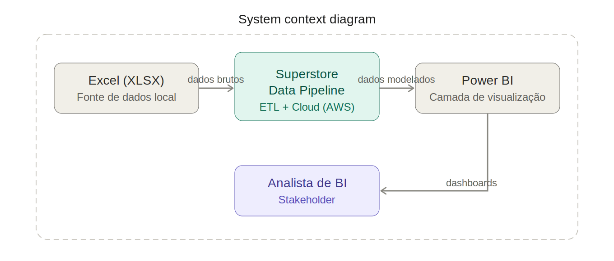

# Case Superstore - BI Analyst

This project presents the resolution of the Superstore case, focusing on building a robust data pipeline and creating a strategic dashboard for detailed analysis of sales, profits, and returns.

### Context Diagram

### Container Diagram (Medallion Architecture)

### Medallion Architecture Details
The project was structured into three main layers using S3:
- **Raw/Landing:** Extraction of raw data from the XLSX file and immediate conversion to columnar format (Parquet) via Python, simulating the initial storage in a Data Lake (AWS S3).
- **Trusted (Silver):** Cleaning and standardization layer. Strict data quality rules were applied, such as removal of unwanted nulls, treatment of categories, string standardization, and the enrichment of null values using existing keys (e.g., filling null `customer_name` by looking up the respective `customer_id` in other records).
- **Refined (Gold):** Dimensional modeling layer. The data was structured into a robust *Star Schema* to optimize performance, analytical cross-referencing, and usability by Power BI.

**AWS Usage:**
- **AWS S3:** Acts as Object Storage, physically archiving partial and final data across the three zones (Raw, Trusted, Refined).
- **AWS Glue (Crawlers):** Used to automatically discover the structure (schema) of the raw datasets and populate the AWS Glue Data Catalog with table definitions ready for querying.
- **AWS Athena:** Analytical engine and transformation engine used for logical view creation, Table Creation operations (`CTAS`), and SQL validation tests.

## Decisions Made
- **Apache Airflow:** Selected for its efficiency in daily scheduling and secure control of dependencies between tasks (e.g., the `materialize_trusted` and `materialize_refined` DAGs are coordinated by a master DAG `orchestrate_superstore`). It also stands out for its resilience mechanisms (automatic retries).
- **AWS Infrastructure (S3, Glue, Athena):** Adoption of Serverless architecture for Big Data processing (Athena) and scalable storage (S3), eliminating the need for database server management and keeping costs under control.
- **Parquet Format:** Chosen from initial extraction for being highly compressible and optimized for large-scale analytical reads. It accelerates queries read by AWS Athena.
- **SQL Quality Validations:** Rigorous implementation of tests in the Trusted layer (e.g., `validate_negative_returns.sql`, `validate_nulls.sql`) to ensure the integrity of the final dashboard, preventing inconsistencies from affecting decision-making.
- **Gitflow:** Adoption of the Gitflow workflow for code versioning. This approach ensures an organized development cycle, with isolated branches for new features, protecting the stability of the main branch (`main`).

## Assumptions
- The orchestrator was configured with a daily execution schedule (`schedule_interval='@daily'`), assuming daily loading routines for the store's base data.
- In alignment with the requested analyses (e.g., *Top 10 Loss-Making Products*), records containing **products with negative profit** were deliberately kept in the data flow to allow clear identification and action against margin offenders.

## Key Transformations Performed
- **Data Cleaning:** Deep string standardization and treatment of missing values (Nulls). Where null values existed, data enrichment in the Silver layer filled them by searching for the corresponding information via its key in other records within the same database.
- **Star Schema Modeling:** What used to be a single transactional base (flat) was broken down into 5 rich dimensions:
  - `dim_customer` (Customer)
  - `dim_product` (Product)
  - `dim_geography` (Geography)
  - `dim_date` (Date)
  - `dim_shipping` (Shipping)
  - And 1 analytical metrics table: `fact_orders` (Orders and Returns Fact Table).
- **Business Keys:** Logical implementation of keys (Surrogate Keys and Natural Keys) to guarantee and enforce proper referential integrity between tables.