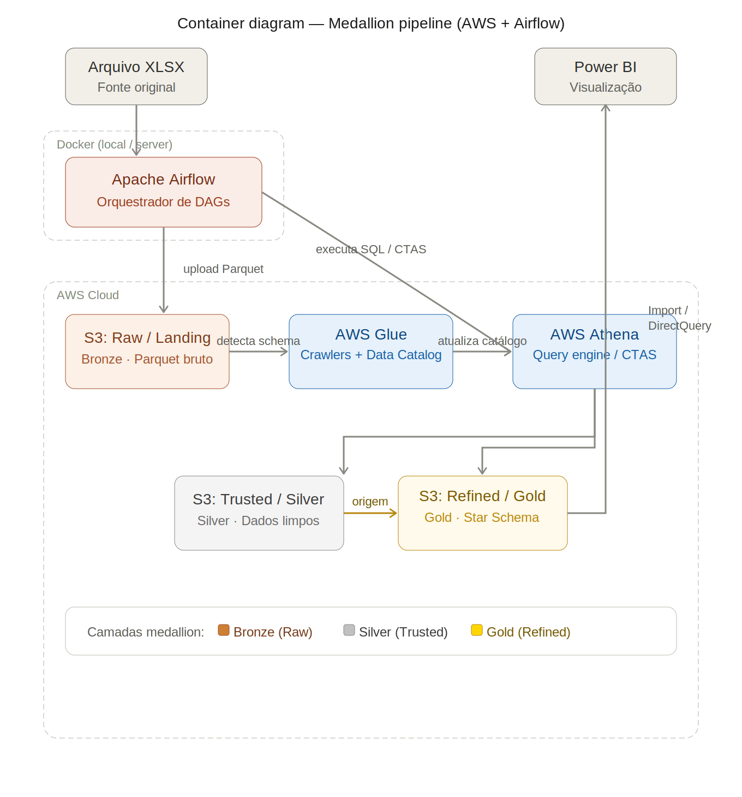

# Case Superstore - BI Analyst

Este projeto apresenta a resolução do case Superstore, com foco na construção de um pipeline de dados robusto e na criação de um dashboard estratégico para análise detalhada de vendas, lucros e devoluções.

### Diagrama de Contexto

### Diagrama de Container (Arquitetura Medallion)

### Detalhamento da Arquitetura Medallion
O projeto foi estruturado em três camadas principais utilizando o S3:
- **Raw/Landing:** Extração dos dados brutos do arquivo XLSX e conversão imediata para formato colunar (Parquet) via Python, simulando o armazenamento inicial em um Data Lake (AWS S3).
- **Trusted (Silver):** Camada de limpeza e padronização. Foram aplicadas regras estritas de qualidade de dados, como remoção de nulos indesejados, tratamento de categorias, padronização de strings e o enriquecimento de valores nulos utilizando chaves existentes (ex: preenchimento de `customer_name` nulo buscando pelo respectivo `customer_id` em outros registros).
- **Refined (Gold):** Camada de modelagem dimensional. Os dados foram estruturados em um robusto *Star Schema* para otimizar a performance, os cruzamentos analíticos e a usabilidade pelo Power BI.

**Uso da AWS:**
- **AWS S3:** Atua como o Storage de objetos, arquivando fisicamente os dados parciais e finais nas três zonas (Raw, Trusted, Refined).
- **AWS Glue (Crawlers):** Utilizado para descobrir automaticamente a estrutura (esquema) dos conjuntos de dados brutos e preencher o AWS Glue Data Catalog com as definições de tabelas prontas para consulta.
- **AWS Athena:** Motor analítico e engine de transformação usado para a criação de views lógicas, execução de operações de criação de tabelas (`CTAS`) e testes de validação SQL.

## Decisões Tomadas
- **Apache Airflow:** Selecionado pela eficiência no agendamento diário e controle seguro de dependências entre tarefas (Ex: as DAGs `materialize_trusted` e `materialize_refined` são coordenadas por uma DAG mestra `orchestrate_superstore`). Se destaca também pelos mecanismos de resiliência (retries automáticos).
- **Infraestrutura AWS (S3, Glue, Athena):** Adoção de arquitetura Serverless para processamento de Big Data (Athena) e armazenamento escalável (S3), o que elimina a necessidade de gestão de servidores de banco de dados e mantém custos sob controle.
- **Formato Parquet:** Escolhido desde a extração inicial por ser altamente compressível e otimizado para leituras analíticas em larga escala. Acelera as queries lidas pelo AWS Athena.
- **Validações de Qualidade em SQL:** Implementação rigorosa de testes na camada Trusted (ex: `validate_negative_returns.sql`, `validate_nulls.sql`) para assegurar a integridade do dashboard final, impedindo que inconsistências afetem a tomada de decisão.
- **Gitflow:** Adoção do fluxo de trabalho Gitflow para versionamento do código. Essa abordagem garante um ciclo de desenvolvimento organizado, com branches isoladas para novas features, protegendo a estabilidade da branch principal (`main`).

## Premissas Adotadas
- O orquestrador foi configurado com um schedule de execução diária (`schedule_interval='@daily'`), assumindo rotinas de cargas diárias para os dados base da loja.
- Em alinhamento com as análises pedidas (ex: *Top 10 Loss-Making Products*), registros contendo **produtos com lucro negativo** foram mantidos no fluxo de dados de forma deliberada para permitir a identificação clara e ação contra os ofensores de margem.

## Principais Transformações Realizadas
- **Limpeza de Dados:** Padronização profunda de strings e tratamento de valores ausentes (Nulos). Onde houveram valores nulos, o enriquecimento de dados na camada Silver, foram preenchidos buscando a informação correspondente através da sua chave em outros registros da mesma base.
- **Modelagem Star Schema:** O que antes era uma base transacional única (flat) foi desmembrado em 5 dimensões ricas:
  - `dim_customer` (Cliente)
  - `dim_product` (Produto)
  - `dim_geography` (Geografia)
  - `dim_date` (Data)
  - `dim_shipping` (Envio)
  - E 1 tabela de métricas analíticas: `fact_orders` (Tabela Fato de Pedidos e devoluções).
- **Chaves de Negócio:** Implementação lógica de chaves (Surrogate Keys e Natural Keys) de forma a garantir e forçar a integridade referencial correta entre as tabelas.